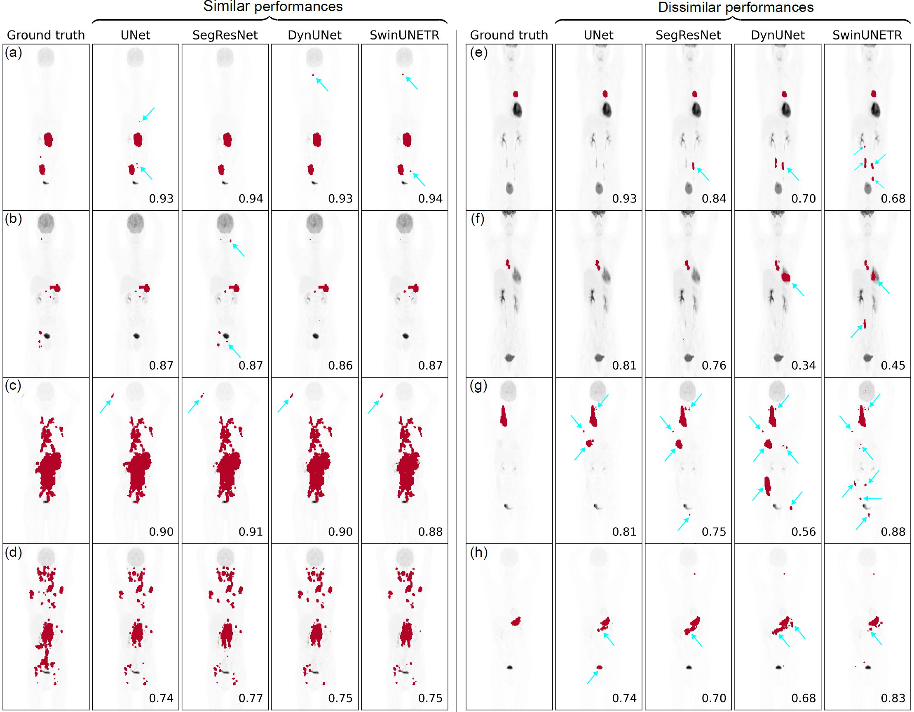
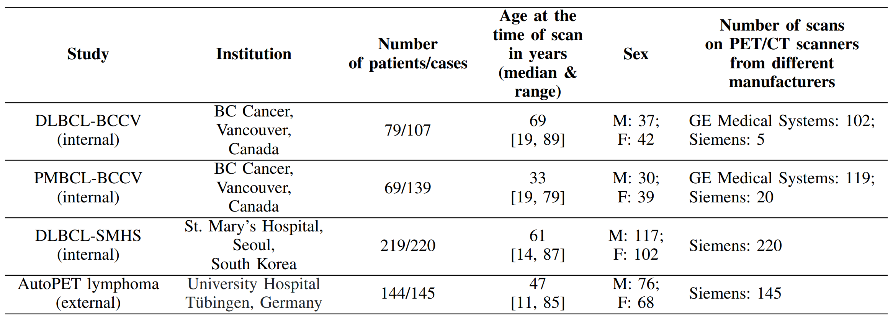

# Lymphoma lesion segmentation and quantitation from FDG PET/CT images using deep neural networks

## Introduction
<p align="center">
  
  <br>
  <em>
  <strong>
    Figure 1: Visualization of performances of networks, UNet, SegResNet, DynUNet, and SwinUNETR on the coronal maximum intensity projection views for 8 representative cases. (a)-(d) show cases where all the networks had similar performances, while (e)-(h) show cases where the networks had dissimilar performances, often due to some of them predicting large false positive volumes (FPVs). Some of the prominent FPVs have been indicated with blue arrows. The number on the bottom-right of each plot shows the DSC between the 3D predicted mask and the ground truth.
   </strong>
  </em>
</p>


Lymphoma lesion segmentation and quantitation plays a pivotal role in the diagnosis, treatment planning, and monitoring of lymphoma patients. Accurate segmentation allows for the precise delineation of pathological regions, aiding clinicians in assessing disease extent and progression. Moreover, lesion quantitation, such as measuring lesion size and metabolic activity, etc. provides critical information for treatment response evaluation. Deep learning-based segmentation methods have emerged as a game-changer in this domain, offering the potential to automate and standardize lesion delineation, reducing inter-observer variability and saving valuable clinical time. 

In this work, we trained four deep neural networks, **UNet**, **SegResNet**, **DynUNet**, and **SwinUNETR** (adapted from MONAI [1]) for the segmentation of lesions from multi-institutional FDG PET/CT images. In this work, we used a large and diverse whole-body PET/CT dataset with a total of **611 cases** coming from four retrospective cohorts, as given in Table 1 below. The first three cohorts (internal cohorts) are privately-owned lymphoma datasets, while the fourth cohort is a subset of the public dataset acquired from [2]. Our models were trained/validated on 80% dataset from the former three cohorts. The remaining 20% data from these three cohorts was used as internal test set, while the fourth cohort was solely used as an external (unseen) test set.    

<p align="center">
  
</p>

Please cite the following paper when you use our code or trained models:
```
Insert paper citation after published
```


## How to get started?
Follow the intructions given below to set up the necessary conda environment, install packages, process dataset in the correct format so it can be accepted as inputs by our code, train models, perform inferences on trained models, compute evaluation metrics (for segmentation and detection) on the test set, and calculate lesion measures from the predicted 3D lesions masks. 

- **Clone the repository, create conda enviroment and install necessary packages:**  
    The first step is to clone this GitHub codebase in your local machine, create a conda environment, and install all the necessary packages. For this step, follow the detailed instructions in [/documentation/conda_env.md](/documentation/conda_env.md). 

- **Get your dataset in the required format:**  
    After you have successfully executed the previous step, it is time to get your PET/CT and binary mask data in a format so that our code can use them as inputs. We have tested this codebased only for NIFTI images (.nii.gz), and provide a script for converting your DICOM PET/CT volumes and RTSTRUCTs to NIFTI format. This data directory setup is slightly based on [nnUNet](https://github.com/MIC-DKFZ/nnUNet/tree/master). For this step, follow the detailed instructions in [/documentation/dataset_format.md](/documentation/dataset_format.md). 

- **Train a model:**  
    Once you have the data folders and data set up, as described in the previous step, you can procceed with training a model. In this work, we have used UNet [], SegResNet [], DynUNet [], and SwinUNETR [] adapted from the MONAI package. For detailed instructions of initiating and running the training script, read [/documentation/trainddp.md](/documentation/trainddp.md). 

    This repository is capable of performing 5 fold cross-validation training, followed by inference on unseen test set, although in the paper above, we only used a single split of train, validation and test images. It is also worth reading [/documentation/results_format.md](/documentation/results_format.md) to understand the overall data and result directories created at different steps of the pipeline and how the different types of results are stored.   

- **Perform inference on test images using a trained model:**  
    Once you have trained your segmentation model(s), you can use them to perform inference on the test set images. In this step, you will save the network predictions as NIFTI files to your local machine. The predicted masks will be in the same geometry as the corresponding ground truth segmentation masks. For this step, follow the detailed instructions given in [/documentation/inference.md](/documentation/inference.md).

- **Compute test set evaluation metrics (for detection and segmentation):**  
    Once the test set predicted masks have been saved, you can proceed to compute the evaluation metrics between the predicted and ground truth segmentation masks. In this work, we use three segmentation metrics: Dice similarity coefficient (DSC), false positive volume (FPV) in ml, and false negative volume (FNV) in ml. We also define three detection based criterion, `Criterion1`, `Criterion2`, and `Criterion3`. Briefly, `Criterion1` labels a predicted lesion as True positive (TP) if it has a non-zero overalap with any of the ground truth lesions. `Criterion2` labels a predicted lesion as TP if it has an intersection-over-union (IoU) > 0.5 with any of the ground truth lesions. `Criterion3` labels a predicted lesion as TP if it overlaps with a ground truth lesion's SUV<sub>max</sub> voxel. For `Criterion2` and `Criterion3`, we first perform a matching to pair up a ground truth lesion with a predicted lesion via IoU maximization. These metrics have been defined in [/metrics/metrics.py](/metrics/metrics.py). 

    To run an evaluation script, follow the detailed instructions given in [/documentation/calculate_test_metrics.md](/documentation/calculate_test_metrics.md).


- **Generate lesion measures from the predicted lesion masks:**    
    We further use the predicted lesion masks to evaluate the predicted lesion measures. In this work, we focus on six patient level lesion measures, namely, patient-level lesion SUV<sub>mean</sub>, lesion SUV<sub>max</sub>, number of lesions, total metabolic tumor volume (TMTV) in ml, total lesion glycolysis (TLG) in ml, and lesion dissemination (D<sub>max</sub>) in cm. All these lesion measures have been shown to be prognostic biomarkers in lymphoma patients in several studies [3-5]. These predicted lesions measures can be correlated with the ground truth lesion measures to assess how good the trained models are in predicting these clinically-relevant metrics of interest.

    To run an lesion measures generation script, follow the detailed instructions given in [/documentation/generate_lesion_measures.md](/documentation/generate_lesion_measures.md).


# Acknowledgments
<p align="center">
  
</p>


# References
<a id="1">[1]</a> 
MONAI: Medical Open Network for AI,
*AI Toolkit for Healthcare Imaging*
[](https://zenodo.org/record/7459814)

<a id="2">[2]</a> 
Gatidis S, Kuestner T., "A whole-body FDG-PET/CT dataset with manually annotated tumor lesions (FDG-PET-CT-Lesions)" [Dataset] (2022), The Cancer Imaging Archive. 
[](https://doi.org/10.7937/gkr0-xv29)

<a id="3">[3]</a> 
K. Okuyucu et al. "Prognosis estimation under the light of metabolic tumor parameters on initial FDG-PET/CT
in patients with primary extranodal lymphoma". en. In: Radiol. Oncol. 50.4 (2016), pp. 360–369
[(doi)](https://doi.org/10.1515/raon-2016-0045)

<a id="4">[4]</a> 
X. Xia et al. "Baseline SUVmax of 18F-FDG PET-CT indicates prognosis of extranodal natural killer/T-cell
lymphoma", en. In: Medicine (Baltimore) 99.37 (2020), e22143.
[(doi)](https://doi.org/10.1097%2FMD.0000000000022143)

<a id="5">[5]</a> 
A.-S. Cottereau et al. "18F-FDG PET dissemination features in diffuse large B-cell lymphoma are predictive of outcome". en. In: J. Nucl. Med. 61.1 (2020),pp. 40–45.
[(doi)](https://doi.org/10.2967/jnumed.119.229450)